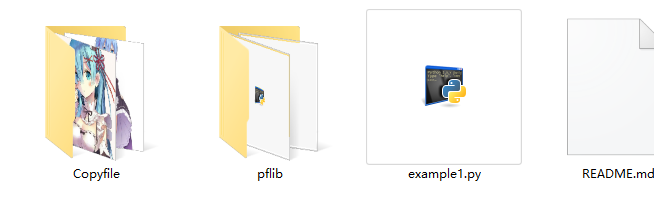

### 一个批量操作文件的工具包
pflib里面用python写了几个函数用来批量操作文件
可以通过pflib包里面的不同模块自由组合，实现一些方便有趣的功能
> 目前还略显简陋，有时间会多写几个模块
也希望各位fork

example1.py是一个例子程序，可以复制某电脑上所有硬盘的媒体文件到U盘中

#### 运行后的结果如下：
所有图片文件都被复制到了Copyfile下

以后就可以轻松的到老师的隐藏PPT了

